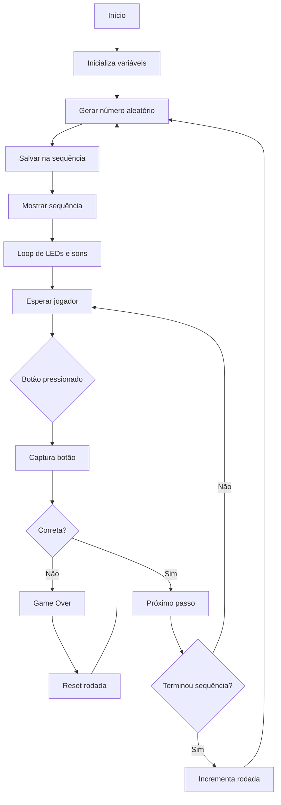

# Genius

# 🎮 Genius com ESP32

Projeto de recriação do clássico jogo de memória **Genius (Simon)** utilizando um microcontrolador ESP32.

O jogo gera uma sequência de LEDs e sons que o jogador deve repetir pressionando os botões correspondentes. A cada rodada correta, a sequência aumenta, tornando o jogo progressivamente mais desafiador.

---

## 🧠 Conceitos Demonstrados

Este projeto demonstra conceitos importantes de sistemas embarcados:

- Programação de microcontroladores
- Controle de LEDs
- Leitura de botões
- Geração de números aleatórios
- Uso de buzzer para geração de som
- Estrutura de lógica de jogo

---

## 🧩 Componentes Utilizados

- 1 × ESP32
- 4 × LEDs (cores diferentes)
- 4 × Resistores 220Ω – 330Ω
- 4 × Botões
- 1 × Buzzer
- Protoboard
- Jumpers

---

## 🔌 Ligações do Circuito

| Componente | GPIO ESP32 |
|-------------|-------------|
| LED 1 | 23 |
| LED 2 | 22 |
| LED 3 | 21 |
| LED 4 | 19 |
| Botão 1 | 18 |
| Botão 2 | 5 |
| Botão 3 | 17 |
| Botão 4 | 16 |
| Buzzer | 27 |

Os botões utilizam **INPUT_PULLUP**, portanto devem ser conectados ao **GND**.

---

## 🎮 Funcionamento do Jogo

1. O ESP32 gera um número aleatório entre **0 e 3**
2. Cada número corresponde a um **LED e um botão**
3. A sequência é exibida usando **LEDs e sons**
4. O jogador deve repetir a sequência pressionando os botões
5. A cada rodada correta, a sequência aumenta
6. Se o jogador errar, ocorre **Game Over**

---

---

## ⚙️ Estrutura do Código

O código foi organizado em funções para facilitar o entendimento:

setup() → Configuração inicial
loop() → Controle principal do jogo
mostrarSequencia() → Exibe sequência de LEDs
lerJogador() → Verifica se jogador acertou
esperarBotao() → Aguarda botão pressionado
tocarSom() → Gera som no buzzer
gameOver() → Indica erro do jogador

---

## 🚀 Possíveis Melhorias

- Aumentar a velocidade conforme as rodadas avançam
- Salvar recorde na memória do ESP32
- Adicionar display OLED
- Modo multiplayer
- Versão com FreeRTOS

---

## 🧪 Simulação

O projeto pode ser simulado utilizando o:

- Wokwi
- https://wokwi.com/projects/433601505660090369

---

## 🎓 Uso Educacional

Este projeto foi desenvolvido para demonstração em **feira de ciências**, mostrando na prática conceitos de:

- eletrônica
- programação
- sistemas embarcados
- lógica de jogos

---

## 📷 Futuras Atualizações

Adicionar:

- fotos do circuito
- vídeo do jogo funcionando
- diagrama do circuito

---

## 📄 Licença

Projeto livre para uso educacional.
